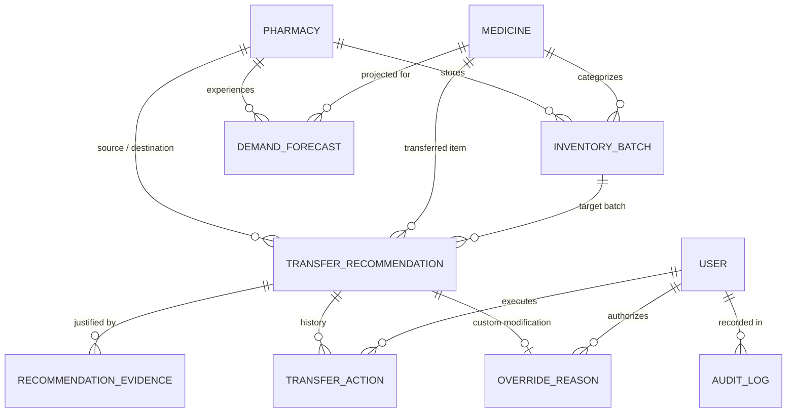

# PharmaShift Database Schema & Data Models

This document provides technical documentation of the relational database schema implemented in PharmaShift. It reflects the production SQLAlchemy ORM models configured for PostgreSQL (production) and SQLite (local zero-config development).

---

## 1. Entity-Relationship Overview

---

## 2. Table Specifications

### 2.1 `users`
Stores user identities, hashed credentials, roles, and branch scoping.

| Column | Data Type | Constraints | Description |
|---|---|---|---|
| `id` | `INTEGER` | Primary Key, Auto-increment, Index | Unique internal user ID |
| `email` | `VARCHAR(255)` | Unique, Not Null, Index | Work email address (used as login identifier) |
| `hashed_password` | `VARCHAR(255)` | Not Null | Salted bcrypt password hash (rounds=10) |
| `full_name` | `VARCHAR(255)` | Not Null | User display name |
| `role` | `VARCHAR(50)` | Not Null, Default: `'PHARMACIST'` | RBAC role: `ADMIN`, `MANAGER`, or `PHARMACIST` |
| `assigned_pharmacy_id` | `VARCHAR(50)` | Nullable | Scopes pharmacist queries to branch (e.g., `'PHARM-001'`). Null for network admins |
| `is_active` | `BOOLEAN` | Not Null, Default: `TRUE` | Soft deactivation flag |
| `created_at` | `TIMESTAMP` | Default: `now()` | Record creation timestamp |

**Relationships:**
- `actions`: One-to-Many with `TransferAction`
- `overrides`: One-to-Many with `OverrideReason`

---

### 2.2 `pharmacies`
Stores registered pharmacy branches across the metropolitan distribution network.

| Column | Data Type | Constraints | Description |
|---|---|---|---|
| `id` | `INTEGER` | Primary Key, Auto-increment, Index | Internal record ID |
| `pharmacy_id` | `VARCHAR(50)` | Unique, Not Null, Index | Business identifier (e.g. `'PHARM-001'`) |
| `pharmacy_name` | `VARCHAR(255)` | Not Null | Facility name (e.g., `'Central Hub Pharmacy'`) |
| `city` | `VARCHAR(100)` | Not Null | Municipal location (e.g., `'Bangalore'`) |
| `latitude` | `FLOAT` | Not Null | GPS Latitude coordinate for Haversine transit math |
| `longitude` | `FLOAT` | Not Null | GPS Longitude coordinate for Haversine transit math |
| `storage_capacity` | `INTEGER` | Not Null, Default: `5000` | Total stock capacity in physical units |
| `operating_status` | `VARCHAR(50)` | Not Null, Default: `'ACTIVE'` | Facility status: `ACTIVE`, `MAINTENANCE`, `CLOSED` |
| `created_at` | `TIMESTAMP` | Default: `now()` | Timestamp of registration |

**Relationships:**
- `inventory_batches`: One-to-Many with `InventoryBatch`

---

### 2.3 `medicines`
Stores the pharmaceutical master catalog including categories and criticality.

| Column | Data Type | Constraints | Description |
|---|---|---|---|
| `id` | `INTEGER` | Primary Key, Auto-increment, Index | Internal catalog ID |
| `medicine_id` | `VARCHAR(50)` | Unique, Not Null, Index | Business SKU ID (e.g. `'MED-001'`) |
| `name` | `VARCHAR(255)` | Not Null, Index | Medication brand and generic trade name |
| `category` | `VARCHAR(100)` | Not Null, Index | Therapeutic class (e.g., `'Antibiotic'`, `'Cardiology'`) |
| `unit_price` | `FLOAT` | Not Null | Unit acquisition price in INR (₹) |
| `is_critical` | `BOOLEAN` | Default: `FALSE` | Clinical flag for emergency/life-saving drugs |
| `storage_type` | `VARCHAR(100)` | Default: `'Room Temperature'` | Storage requirement: `'Cold Chain (2-8°C)'`, etc. |
| `created_at` | `TIMESTAMP` | Default: `now()` | Catalog entry timestamp |

**Relationships:**
- `inventory_batches`: One-to-Many with `InventoryBatch`

---

### 2.4 `inventory_batches`
Stores individual physical stock lots located at specific pharmacy branches.

| Column | Data Type | Constraints | Description |
|---|---|---|---|
| `id` | `INTEGER` | Primary Key, Auto-increment, Index | Internal inventory record ID |
| `inventory_id` | `VARCHAR(50)` | Unique, Not Null, Index | Unique tracked inventory item ID |
| `medicine_id` | `VARCHAR(50)` | FK -> `medicines.medicine_id`, Not Null | Associated medicine |
| `medicine_name` | `VARCHAR(255)` | Not Null | Denormalized medicine name for query speed |
| `medicine_category`| `VARCHAR(100)` | Not Null | Denormalized category |
| `batch_id` | `VARCHAR(100)` | Not Null, Index | Manufacturer lot/batch number |
| `pharmacy_id` | `VARCHAR(50)` | FK -> `pharmacies.pharmacy_id`, Not Null | Current physical storage location |
| `quantity` | `INTEGER` | Not Null | Current physical unit count |
| `unit_price` | `FLOAT` | Not Null | Acquired unit price |
| `expiry_date` | `VARCHAR(50)` | Not Null, Index | Expiration date formatted as `YYYY-MM-DD` |
| `received_date` | `VARCHAR(50)` | Not Null | Stock arrival date |
| `stock_status` | `VARCHAR(50)` | Not Null, Default: `'AVAILABLE'` | Operational status: `AVAILABLE`, `NEAR_EXPIRY`, `EXPIRED` |
| `edge_case_tag` | `VARCHAR(100)`| Default: `'NONE'` | Test tag (e.g. `'BELOW_SAFETY_STOCK'`, `'EXPIRES_BEFORE_TRANSIT'`) |
| `created_at` | `TIMESTAMP` | Default: `now()` | Record insertion timestamp |

**Foreign Keys:**
- `medicine_id` references `medicines(medicine_id)`
- `pharmacy_id` references `pharmacies(pharmacy_id)`

**Relationships:**
- `medicine`: Many-to-One with `Medicine`
- `pharmacy`: Many-to-One with `Pharmacy`
- `recommendations`: One-to-Many with `TransferRecommendation`

---

### 2.5 `demand_forecasts`
Stores daily dispensing velocity metrics and ML predictions for each pharmacy-medicine pair.

| Column | Data Type | Constraints | Description |
|---|---|---|---|
| `id` | `INTEGER` | Primary Key, Auto-increment, Index | Internal forecast ID |
| `medicine_id` | `VARCHAR(50)` | FK -> `medicines.medicine_id`, Not Null | Target medicine SKU |
| `pharmacy_id` | `VARCHAR(50)` | FK -> `pharmacies.pharmacy_id`, Not Null | Target pharmacy branch |
| `daily_demand` | `FLOAT` | Not Null, Default: `1.0` | Baseline daily dispensing rate |
| `weekly_demand`| `FLOAT` | Not Null, Default: `7.0` | 7-day dispensing volume |
| `monthly_demand`| `FLOAT`| Not Null, Default: `30.0` | 30-day dispensing volume |
| `historical_demand`| `FLOAT`| Not Null, Default: `30.0`| Long-term dispensing benchmark |
| `demand_trend` | `VARCHAR(50)` | Default: `'STABLE'` | Velocity trend: `STABLE`, `INCREASING`, `DECREASING`, `VOLATILE` |
| `ml_predicted_demand` | `FLOAT`| Nullable | Predicted demand generated by RandomForestRegressor |
| `updated_at` | `TIMESTAMP` | Default: `now()` | Last calculation timestamp |

---

### 2.6 `transfer_recommendations`
Stores generated stock redistribution proposals with risk scoring and explainability.

| Column | Data Type | Constraints | Description |
|---|---|---|---|
| `id` | `INTEGER` | Primary Key, Auto-increment, Index | Internal recommendation ID |
| `recommendation_id` | `VARCHAR(50)` | Unique, Not Null, Index | Public ID (e.g. `'REC-4F2A9B1C'`) |
| `inventory_id` | `VARCHAR(50)` | FK -> `inventory_batches.inventory_id` | Source batch |
| `batch_id` | `VARCHAR(100)` | Not Null | Manufacturer lot code |
| `medicine_id` | `VARCHAR(50)` | FK -> `medicines.medicine_id` | Medication transferred |
| `medicine_name` | `VARCHAR(255)` | Not Null | Display name of medicine |
| `source_pharmacy_id` | `VARCHAR(50)` | FK -> `pharmacies.pharmacy_id`, Index | Origin branch |
| `destination_pharmacy_id` | `VARCHAR(50)` | FK -> `pharmacies.pharmacy_id`, Index | Destination branch |
| `source_pharmacy_name` | `VARCHAR(255)` | Not Null | Origin branch name |
| `destination_pharmacy_name` | `VARCHAR(255)` | Not Null | Destination branch name |
| `recommended_quantity` | `INTEGER` | Not Null | Recommended transfer volume in units |
| `unit_price` | `FLOAT` | Not Null | Price per unit |
| `potential_value_saved` | `FLOAT` | Not Null | Protected monetary value: `recommended_quantity * unit_price` |
| `days_to_expiry` | `INTEGER` | Not Null | Remaining shelf-life in days |
| `distance_km` | `FLOAT` | Not Null | Road distance between branches via Haversine |
| `estimated_transit_days` | `INTEGER` | Not Null | Estimated courier transit time in days |
| `risk_level` | `VARCHAR(50)` | Not Null | Clinical urgency: `CRITICAL`, `HIGH`, `MEDIUM`, `LOW` |
| `confidence_score` | `FLOAT` | Not Null, Default: `0.85` | Backward-compatibility decimal score |
| `recommendation_score` | `FLOAT` | Nullable | Normalized explainable score (0-100) |
| `predicted_demand` | `FLOAT` | Nullable | Destination daily demand velocity from ML model |
| `demand_source` | `VARCHAR(50)` | Default: `'ML_PREDICTION'` | Provenance: `ML_PREDICTION`, `STORED_FORECAST`, `HEURISTIC_FALLBACK` |
| `status` | `VARCHAR(50)` | Not Null, Default: `'PENDING'` | State: `PENDING`, `APPROVED`, `REJECTED`, `OVERRIDDEN`, `COMPLETED` |
| `is_high_impact` | `BOOLEAN` | Default: `FALSE` | Triggers mandatory human confirmation check |
| `created_at` | `TIMESTAMP` | Default: `now()` | Timestamp of recommendation creation |
| `updated_at` | `TIMESTAMP` | Default: `now()` | Timestamp of state transition |

**Relationships:**
- `inventory_batch`: Many-to-One with `InventoryBatch`
- `evidence`: One-to-Many with `RecommendationEvidence` (cascade delete)
- `actions`: One-to-Many with `TransferAction`
- `override`: One-to-One with `OverrideReason`

---

### 2.7 `recommendation_evidence`
Stores structured, human-readable evidence metrics for full explainability.

| Column | Data Type | Constraints | Description |
|---|---|---|---|
| `id` | `INTEGER` | Primary Key, Auto-increment, Index | Internal ID |
| `recommendation_id` | `VARCHAR(50)` | FK -> `transfer_recommendations.recommendation_id`, Index | Parent recommendation |
| `evidence_bullet` | `VARCHAR(500)` | Not Null | Factual justification text shown in modal |
| `metric_name` | `VARCHAR(100)` | Nullable | Machine identifier (e.g. `'SOURCE_EXCESS'`, `'PREDICTED_DEMAND'`) |
| `metric_value` | `VARCHAR(100)` | Nullable | Formatted value string |

---

### 2.8 `transfer_actions`
Stores human approval, rejection, and override execution events.

| Column | Data Type | Constraints | Description |
|---|---|---|---|
| `id` | `INTEGER` | Primary Key, Auto-increment, Index | Action record ID |
| `recommendation_id` | `VARCHAR(50)` | FK -> `transfer_recommendations.recommendation_id` | Associated recommendation |
| `user_id` | `INTEGER` | FK -> `users.id` | Acting user |
| `action_type` | `VARCHAR(50)` | Not Null | Action executed: `APPROVED`, `REJECTED`, `OVERRIDDEN` |
| `transferred_quantity` | `INTEGER` | Not Null | Quantity committed in the order |
| `action_timestamp` | `TIMESTAMP` | Default: `now()` | Timestamp of execution |
| `notes` | `TEXT` | Nullable | Human reviewer comments |

---

### 2.9 `override_reasons`
Captures structured reasoning when a human manager alters recommendation quantities.

| Column | Data Type | Constraints | Description |
|---|---|---|---|
| `id` | `INTEGER` | Primary Key, Auto-increment, Index | Override record ID |
| `recommendation_id` | `VARCHAR(50)` | FK -> `transfer_recommendations.recommendation_id`, Unique | Target recommendation |
| `reason_category` | `VARCHAR(150)` | Not Null | Category: `'Manager decision'`, `'Storage constraints'`, etc. |
| `custom_reason` | `TEXT` | Nullable | Detailed textual explanation from manager |
| `overridden_quantity` | `INTEGER` | Nullable | Adjusted unit count |
| `user_id` | `INTEGER` | FK -> `users.id` | Authorizing user |
| `created_at` | `TIMESTAMP` | Default: `now()` | Timestamp of override |

---

### 2.10 `audit_logs`
Immutable compliance and traceability audit log.

| Column | Data Type | Constraints | Description |
|---|---|---|---|
| `id` | `INTEGER` | Primary Key, Auto-increment, Index | Audit entry sequence number |
| `user_id` | `INTEGER` | Nullable | Acting user ID (nullable for automated system jobs) |
| `user_email` | `VARCHAR(255)` | Not Null | Authenticated actor email |
| `user_role` | `VARCHAR(50)` | Not Null | Role at time of action (`ADMIN`, `MANAGER`, `PHARMACIST`, `SYSTEM`) |
| `recommendation_id` | `VARCHAR(50)` | Nullable, Index | Target recommendation if applicable |
| `action` | `VARCHAR(50)` | Not Null | Operational event (`APPROVED`, `REJECTED`, `OVERRIDDEN`, `SEEDED`) |
| `previous_state` | `VARCHAR(50)` | Nullable | Prior recommendation status (`PENDING`) |
| `new_state` | `VARCHAR(50)` | Nullable | New recommendation status (`APPROVED`, `REJECTED`, etc.) |
| `quantity` | `INTEGER` | Nullable | Quantity involved in operation |
| `source_pharmacy_id` | `VARCHAR(50)` | Nullable | Origin branch |
| `destination_pharmacy_id` | `VARCHAR(50)` | Nullable | Destination branch |
| `reason` | `TEXT` | Nullable | Operational justification |
| `timestamp` | `TIMESTAMP` | Default: `now()`, Index | Immutable UTC event timestamp |
