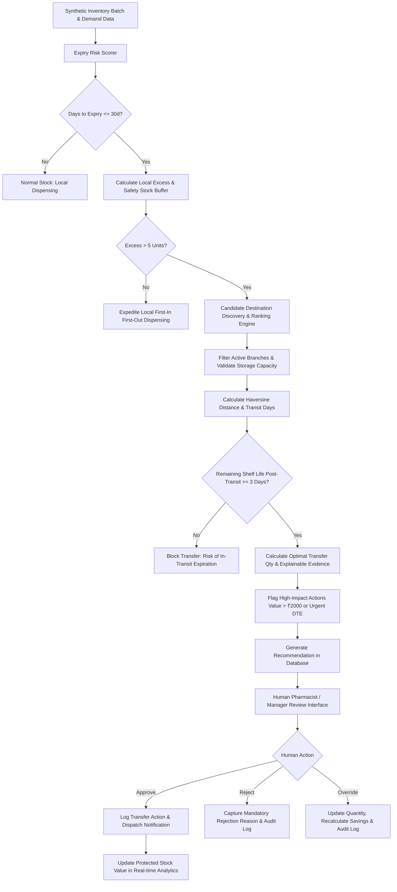

# Operational Workflow & System Architecture

## Step-by-Step Operational Workflow

### 1. Ingestion & Continuous Risk Auditing
- The system continuously parses inventory batch records from the PostgreSQL database.
- Batches are classified into **CRITICAL** ($\le 7$ days), **HIGH** (8–30 days), **MEDIUM** (31–60 days), **LOW** ($>60$ days), or **EXPIRED** ($\le 0$ days).

### 2. Local Excess & Safety Buffer Calculation
- Using either rolling historical velocity or ML-predicted daily demand, the engine calculates how many units can realistically be dispensed locally before expiration.
- A 3-day local safety stock buffer is reserved to protect against immediate patient walk-in shortages at the source branch.

### 3. Destination Candidate Discovery & Ranking
- For batches with surplus stock, the engine evaluates all active candidate pharmacies in the metropolitan network.
- The ranking objective function balances:
  $$\text{Score} = (\text{Destination Demand Velocity} \times 12.0) + (\text{Post-Transit Shelf Life} \times 2.5) - (\text{Distance km} \times 0.35)$$
- Life-saving / critical medications receive priority weighting.

### 4. Explainable Evidence & Impact Evaluation
- Recommendations are accompanied by factual evidence bullets detailing transit distance, velocity comparison, capacity window, and protected monetary value.
- Transfers exceeding ₹2,000 or involving $< 14$ days shelf-life are flagged as **High-Impact**, requiring explicit confirmation.

### 5. Human-in-the-Loop Oversight & Immutable Audit Trail
- Branch pharmacists and regional supply chain managers review recommendations in the web dashboard.
- Every approval, rejection reason, or quantity override is cryptographically linked to the user's role and permanently recorded in the immutable audit log table.
